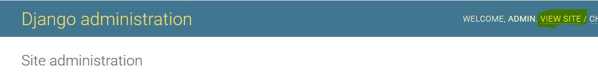
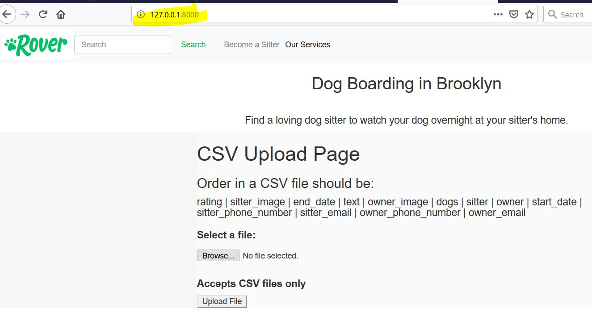
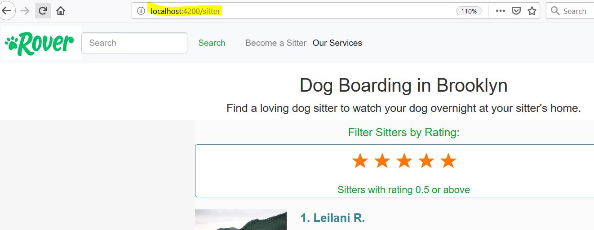
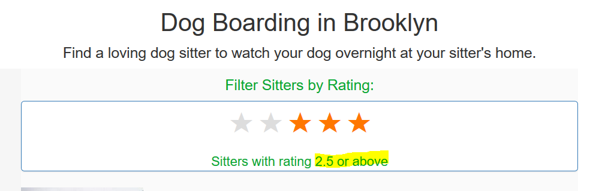

# DjangoAngularRatingProject

Given data in CSV file:

- Rebuild pet owners' accounts and pet sitters profiles
- Recreate a search ranking algorithm
- Build an appealing search results page

## Rebuilding Accounts and Profiles
Based on data in CSV file design a database schema

**NOTE**: If a stay includes multiple pets, those names will be included in the same column of the CSV "|" delimited.

## Recreating the Search Ranking Algorithm

- For each sitter, we calculate Overall Sitter Rank
- Sitter Score is 5 times the fraction of the English alphabet comprised by the distinct letters in what we've recovered of the sitter's name.
- Ratings Score is the average of their stay ratings.
- The Overall Sitter Rank is a weighted average of the Sitter Score and Ratings Score, weighted by the number of stays. When a sitter has no stays, their Overall Sitter Rank is equal to the Sitter Score.  When a sitter has 10 or more stays, their Overall Sitter Rank is equal to the Ratings Score.
- In the event that two or more sitters have the same Overall Sitter Rank, the ordering is unimportant and does not need to be handled.

The Overall Sitter Rank and it's score components must be kept up to date. That means whenever a relevant event happens, that could affect the Overall Sitter Rank, we need to recompute it.

The Overall Sitter Rank recalculation is triggered on stays changes.

## Building a Sitter List

Sitters displayed on a page in order of their *Overall Sitter Rank*.

Each row displays a sitter with his name, photo and their *Ratings Score*. 
Only *Ratings Score* displayed , but sorted by their *Overall Sitter Rank*. 
*Ratings Score* is a publicly disclosed concept and sitter attribute, and the *Overall Sitter Rank* is company's marketplace "secret sauce" that should remain private.

## Filtering Sitters

Customers are able to filter out sitters on the page with poor average stay ratings.
Allow users to filter out sitters whose average ratings is below a user specified value.

---------------------------------------------------------------------------
------------            Instructions / My Approach             ------------
---------------------------------------------------------------------------

 - Backend developed with Django REST Framework
 - File upload implemented with Django
 - Frontend developed with Angular
 - Unittest in rover_app/tests.py
 - rover_app/utils.py has all custom functions
 - database: sqlite

Instructions:

    1. Installation instructions for WINDOWS OS:
    -----------------------------------------

	  1.1: Django (all needed installations are in requirements.txt):

        cd DjangoAngularRatingProject\backend

        create virtual environment:
        ---------------------------
        python -m venv myvenv

        activate virtual environment:
        -----------------------------
        myvenv\Scripts\activate

        install pip:
        ------------
        python -m pip install --upgrade pip

        install using requirements.txt file:
        ------------------------------------
        pip install -r requirements.txt

	  
	  1.2. Angular
	  
		I used:
			node -v: 	10.15.3
			npm -v: 	6.4.1
			ng --version: 	8.0.3
			
		
		To install Node.JS:
			Download NodeJS from: https://nodejs.org/en/download/ 
			Unzip in fromend directory
		
		To install Angular CLI:
			npm install -g @angular/cli
	  
	2. To run the project:

		2.1. Django:
		
		- makemigrations, migrate		
		- create superuser		
		- runserver	
		- login with superuser
		
		To upload CSV files:
		--------------------
		
		- There is no need to run Angular in order to upload CSV files
		
		- Login into Django admin panel with superuser (only superusers can upload files)
		
		- To get form to upload files:
			go to: http://127.0.0.1:8000/   or click "view site" from Django Admin Panel
			

			
		
		2.2 Angular:
		
			To run:
				cd DjangoAngularRatingProject\frontend
				ng serve
		
		- frontend for sitters page is located 
		
			http://localhost:4200/sitter
			

			
	3. Test:
	
		python manage.py test rover_app\tests
	

#1. Rebuilding Profiles

	 1. Model:
		I created the following models: Owner, Sitter, Pet, Stay
		Owners can have multiple pets.
		Stay model is a junction model to maintain many to many relations between Owners and Sitters.
		In addition, since each stay may include multiple dogs, stay has a list of pets and the 5-th table created automatically.

	    I created a a form to upload a CSV file.
	
 2. Recreate a search ranking algorithm:
 
		I used the following equation for stays between 1 and 9 (inclusive)

		Overall Sitter Rank = (Rating_Score - Sitter_Score) / 10 * Stays * (Rating_Score / 5) + Sitter_Score

 3. Build an appealing search results page
	    
	    Used Angular for single page fronend and filter out by rating.

	    I round all ratings up to 2 digits after a decimal point.
	    Example: 2.674 rounded to 2.67
		     2.675 rounded to 2.68

	    Average rating displayed both as a number and with stars, but represenrtation of partial rating is not supported. Float number ratings rounded to decimals.
	    Example: 2.5 will be displayed with 3 stars
		     2.49 will be displayed with 2 stars.

	    On filtering ratings are rounded also.
	    Example: to filter out sitters with rating 1 and 2 - all sitters having rating higher than 2.5 will be displayed as numbers in range 1.5 - 2.49 rounded to 2, while numbers in range 2.5 1 - 2.99 rounded to 2 stars.
	   

Implemented the following Tests:
--------------------------------
	- Models
	- Views
	- API (views)
	- Rating Calculations

	Improvements I consider:
	- better design
	- partial rating with stars
	- tests for fronend
